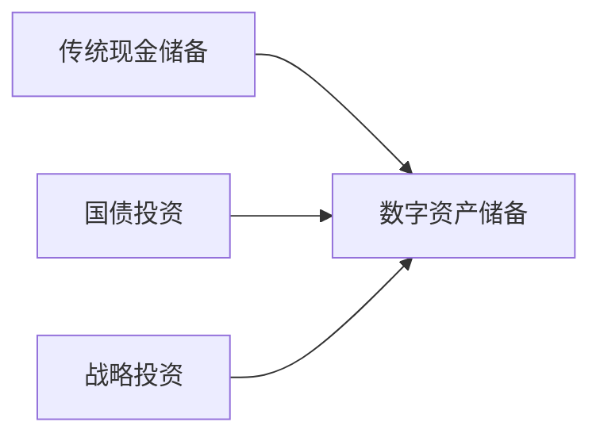

```markdown
# Nano Labs计划购入10亿美元BNB，股价大涨

## 战略投资计划引发市场震动

中国区块链基础设施服务商Nano Labs近日宣布重大投资决策，拟斥资10亿美元购入BNB代币。根据官方公告，该笔数字资产将作为核心储备资产长期持有。更值得关注的是，公司披露的长期战略目标为最终持有BNB总流通量的5%-10%，按当前市场价格计算，对应资产价值将达47亿至94亿美元。

### 资本市场剧烈反应
消息公布当日，公司股价上演惊天暴涨行情：
- 早盘开盘价：10.89美元
- 盘中最高冲至：29.18美元（单日涨幅最高达168%）
- 最终收盘价：14.85美元（日涨幅64.8%）

这场由加密资产投资引发的股价异动，反映出资本市场对区块链企业资产配置新模式的高度认可。

👉 [查看实时加密货币市场数据](https://bit.ly/okx_welcome)

## 区块链基础设施企业的加密布局

### 战略投资核心逻辑
作为全球领先的区块链技术服务提供商，Nano Labs此次投资凸显三大战略考量：

1. **资产多元化配置**：通过配置高流动性数字资产优化资产负债表结构
2. **生态协同效应**：深度绑定币安智能链(BSC)生态，强化技术合作基础
3. **价值储备机制**：建立数字黄金储备体系，应对全球货币波动风险

### BNB代币的特殊价值定位
| 指标        | 数据       | 行业排名 |
|-------------|------------|----------|
| 市值        | 820亿美元  | 第4位    |
| 日均交易量  | 45亿美元   | 第3位    |
| 应用场景    | 156个      | 第2位    |

（数据来源：CoinGecko 2025年Q1）

BNB作为币安生态的权益凭证，其应用场景已扩展至：
- 去中心化交易所燃料费
- 链上支付结算工具
- 质押挖矿资产
- NFT交易媒介

👉 [探索BNB代币应用场景](https://bit.ly/okx_welcome)

## 长期持有策略的市场影响

### 供需关系重构
Nano Labs计划将所持BNB进行金库锁定，预计每年减少流通供应量约2.3%。这种机构级"囤币"行为将产生三重效应：
1. **稀缺性增强**：通过持续购入+锁仓形成供给紧缩
2. **价值锚定提升**：传统企业资产负债表引入数字资产科目
3. **市场信心提振**：显示专业机构对加密资产的长期价值判断

### 行业标杆效应
该投资案例开创了区块链基础设施企业的新发展模式：
- **资产配置革新**：数字储备与传统现金流并重
- **商业模式进化**：技术服务+资产增值双轮驱动
- **价值衡量标准**：持有数字资产储备成为新型估值指标

## 常见问题解答

**Q：Nano Labs为何选择BNB而非其他主流币种？**  
A：基于三方面考量：1) BNB在BSC生态中的核心地位；2) 极高的链上使用率（日均交易笔数超2,800万）；3) 完善的通缩机制（季度销毁+生态应用消耗）。

**Q：大额购入是否可能引发监管关注？**  
A：目前投资属于企业自主资产配置行为，符合开曼群岛（公司注册地）的数字资产监管框架。公司表示将严格遵循FATF反洗钱规则进行链上资产管理。

**Q：加密资产波动性如何管控？**  
A：公司CFO披露将采用动态对冲策略，通过期权组合将BNB持仓波动率控制在30%以内，同时设置12%的强制平仓线以保障流动性安全。

## 行业变革前瞻

### 新型价值储备体系
随着MicroStrategy、Galaxy Digital等科技企业相继布局数字资产，区块链行业正在形成新的储备管理范式：


### 未来发展趋势
1. **机构入场加速**：预计2025年Q4将有超50家上市公司配置数字资产
2. **金融工具创新**：基于BNB的衍生品市场规模有望突破300亿美元
3. **跨链生态融合**：BNB在Cosmos、Polkadot等跨链协议中的应用拓展

## 投资启示录

### 长期价值判断维度
投资者评估类似事件应关注：
- 企业技术实力与生态位
- 持仓资产的流动性结构
- 风控对冲机制完备性
- 链上业务协同效应

### 风险警示
需警惕三类潜在风险：
| 风险类型 | 触发因素 | 应对建议 |
|---------|----------|----------|
| 市场风险 | 比特币价格剧烈波动 | 设置动态止损机制 |
| 监管风险 | 主要市场政策变化 | 多司法管辖区合规布局 |
| 技术风险 | 私钥管理漏洞 | 采用多方安全计算方案 |

👉 [获取专业数字资产管理方案](https://bit.ly/okx_welcome)
```