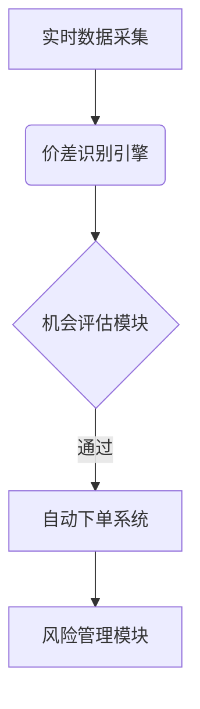

# 算法交易中的套利交易策略

## 什么是套利策略？

套利策略是理解容易但精通困难的交易方式之一。其核心逻辑在于通过捕捉同一资产在不同市场的价格差异获取收益。当同一资产在A市场报价为X，在B市场报价为Y时，交易者可通过低买高卖实现无风险套利。

👉 [如何利用自动化工具提升交易效率](https://bit.ly/okx_welcome)

这种策略最早可追溯至古代商人跨区域商品贸易。现代金融市场中，专业交易员（套利者）通过高频交易系统捕捉毫秒级价格偏差。需要强调的是，完全有效的市场中不存在套利机会，正是市场非均衡状态创造了交易空间。

### 套利交易的三大特征
1. 需要至少两个市场价格差异
2. 要求资产具有高度同质性
3. 依赖快速执行系统捕捉机会

## 套利类型详解

### 纯套利：基础价差交易
纯套利是最直观的形式，典型场景包括：
- 外汇市场：利用不同交易所的汇率差异
- 证券市场：同一股票在A股与港股的价差
- 期货市场：现货与期货合约的基差机会

交易者需关注流动性差异、交易成本（含点差、手续费、税费）等因素。以黄金ETF为例，当上海金交所与伦敦金银市场出现价差超过1%时，专业机构可启动跨市场套利。

### 并购套利：事件驱动型机会
当两家上市公司宣布并购时，通常会出现两类机会：
1. 被收购方股价通常存在折价空间
2. 收购方可能释放套利机会

典型操作模式：
| 交易阶段 | 操作策略 | 风险因素 |
|---------|---------|---------|
| 宣布前 | 建立潜在标的多头仓位 | 信息泄露风险 |
| 宣布后 | 反向套利（买被收购方/卖收购方） | 并购失败概率 |
| 交割期 | 现金套利 | 交割时间差 |

### 可转债套利：结构化产品机会
该策略涉及可转换债券与标的股票的对冲操作：
- 当债券价格被低估时：做多债券+做空股票
- 当债券价格被高估时：做空债券+做多股票

关键参数监控表：
| 参数 | 监控频率 | 触发阈值 |
|------|---------|---------|
| 转换溢价率 | 实时 | >15% |
| 隐含波动率 | 每日 | 历史30日分位数 |
| 基差 | 每小时 | 超过交易成本 |

## 经典套利案例解析

以跨境上市企业XYZ为例：
1. 美国市场报价：$16/股
2. 加拿大市场报价：CAD20/股
3. 汇率换算：1USD≈1.35CAD

套利机会计算：
```
加拿大市场价格折合美元 = 20CAD ÷ 1.35 ≈ $14.81
价差 = $16 - $14.81 = $1.19/股
```
扣除双边手续费（约$0.15）后，每股权益可达$1.04。若批量操作10万股，理论收益可达$104,000。

👉 [实战案例：跨境套利操作全流程](https://bit.ly/okx_welcome)

## 套利策略的市场价值

### 对市场效率的促进作用
套利行为客观上推动价格回归均衡，其市场调节机制如下：
1. 低价市场买盘推高价格
2. 高价市场卖压拉低价格
3. 最终实现跨市场价格收敛

### 流动性提供者的角色
专业套利者通过持续报价为市场注入流动性，其贡献体现在：
- 缩小买卖价差
- 提高市场深度
- 降低交易摩擦成本

## 自动化套利系统构建

现代套利高度依赖算法交易系统，其核心模块包括：


### 系统关键参数设置
1. 延迟容忍度：<50ms
2. 价差触发阈值：>交易成本150%
3. 持仓时间窗口：≤15分钟

## 风险控制要点

### 常见风险类型
| 风险类型 | 典型案例 | 应对策略 |
|---------|---------|---------|
| 价格波动 | 突发新闻导致单边行情 | 动态调整对冲比例 |
| 执行延迟 | 网络拥堵导致滑点 | 多节点部署系统 |
| 政策变化 | 跨境资金管制 | 多市场合规备案 |

### 风险管理指标
- 最大回撤控制：≤单日净值2%
- 头寸集中度：单一机会≤总资金5%
- 保证金使用率：≤70%

## 常见问题解答

### Q：套利交易需要多大资金规模？
A：个人投资者可从10万元人民币起步，机构通常需要百万级美元配置。资金规模直接影响可操作标的范围和收益稳定性。

### Q：新手如何开始套利交易？
A：建议遵循三步走策略：
1. 模拟交易3个月熟悉系统
2. 选择单一策略（如ETF套利）实盘测试
3. 逐步扩展至多策略组合

### Q：套利机会持续时间有多长？
A：统计数据显示：
- 70%的机会持续<5分钟
- 90%的机会持续<30分钟
- 仅3%的机会可持续2小时以上

### Q：自动化系统是否必要？
A：对于高频机会（日均出现>10次）建议使用自动化，低频机会可手动操作。自动化系统能提升执行效率40%-60%。

### Q：如何评估套利策略表现？
A：核心评估指标应包括：
- 年化波动率
- 最大回撤周期
- 夏普比率（建议>1.5）
- 交易胜率（建议>65%）

## 未来发展展望

随着AI技术的发展，套利策略正呈现三大趋势：
1. 机器学习优化：通过神经网络预测价差收敛路径
2. 多因子模型：整合基本面、技术面、情绪面数据
3. 跨资产联动：打通股票、期货、期权、加密资产的套利网络

👉 [探索AI驱动的智能套利新纪元](https://bit.ly/okx_welcome)

传统套利模式正在向"智能阿尔法捕获系统"进化，未来成功的套利者需要同时具备金融工程能力、编程技能和风险管理经验。对于普通投资者，选择经过验证的智能投顾平台可能是更优方案。